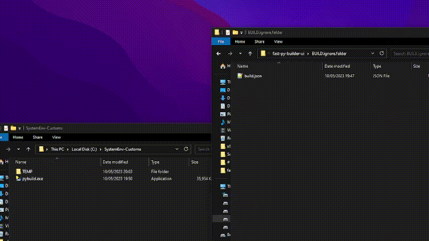

#### [Download](https://github.com/qwertzuiii/fast-py-builder-ui/releases/latest)

# Py-Build

A pyinstaller GUI, which can be put in a Environment-Variable Folder (to open it fast in a cmd)

---

## Build.json?

yes, if you open the program (recommended in a Folder, that is in the Environment-Variables), there where you open pybuild, it checks, if there is a build.json.

To make your own one, look in [/build.json](https://github.com/qwertzuiii/fast-py-builder-ui/blob/main/build.json)!

---
## TODOs

- [ ] Changable build settings in UI  [LOW-PRIORITY]
    - [ ] With export function  [LOW-PRIORITY]

---

## How to edit the source code?

[Download source code](https://github.com/qwertzuiii/fast-py-builder-ui/archive/refs/heads/main.zip)

`pip install -r requirements.txt`